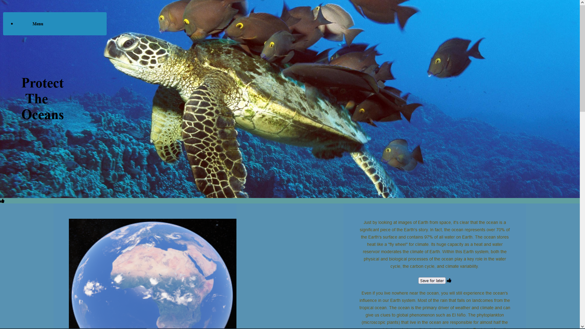
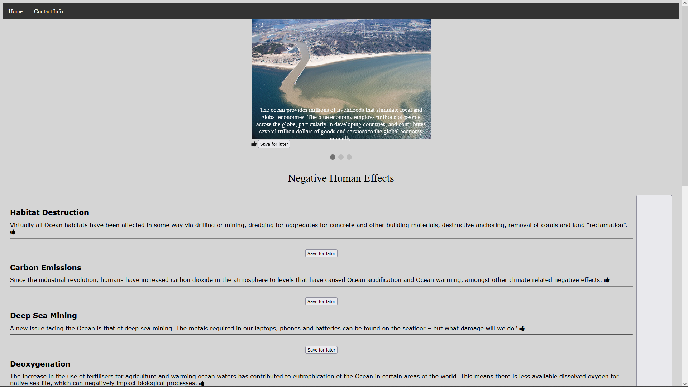
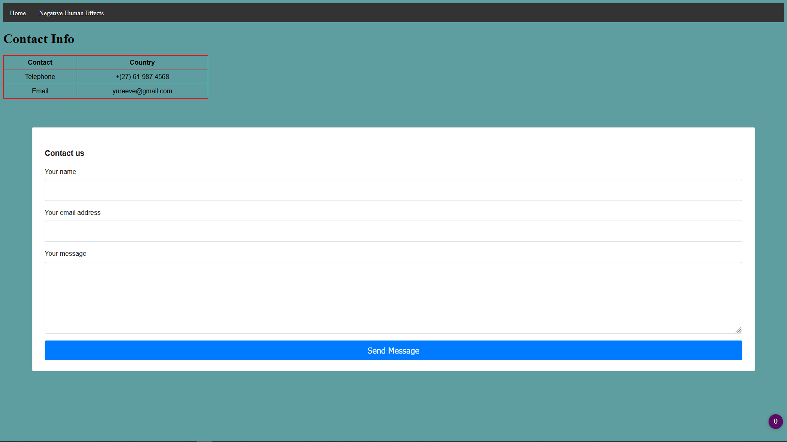

# Ocean-Awareness

1. [ Description. ](#desc)
2. [ Installation. ](#install)
3. [ Usage tips. ](#usage)
4. [ Screen Grabs. ](#images)
5. [ Authors. ](#auth)

## 1. Description

This repository is a website to promote the awareness for ocean conservation. It consists of 4 HTML 5 JS and 6 CSS files.
It displays the importance of the ocean to the earth and negative effects on the ocean. 

## 2. Installtion

Once downloaded go your code editor and open up all files.

## 3. Usage tips

The index.html is the first webpage. 
To view index.html and or another HTML page, open the file in your browser. 

## 4. Screen Grabs

- **index.html**

- **Negative Human Effects.html**

- **contact_Info.html**

### Authors:

- **Owner of this repo**. Yureeve Rambridge. Available at: https://github.com/YureeveRambridge

